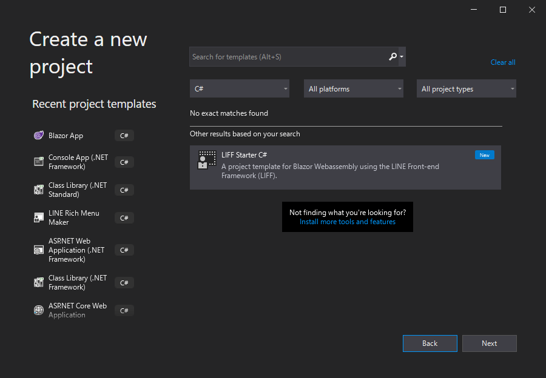
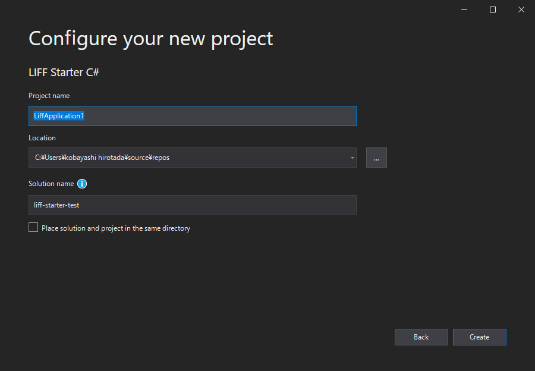
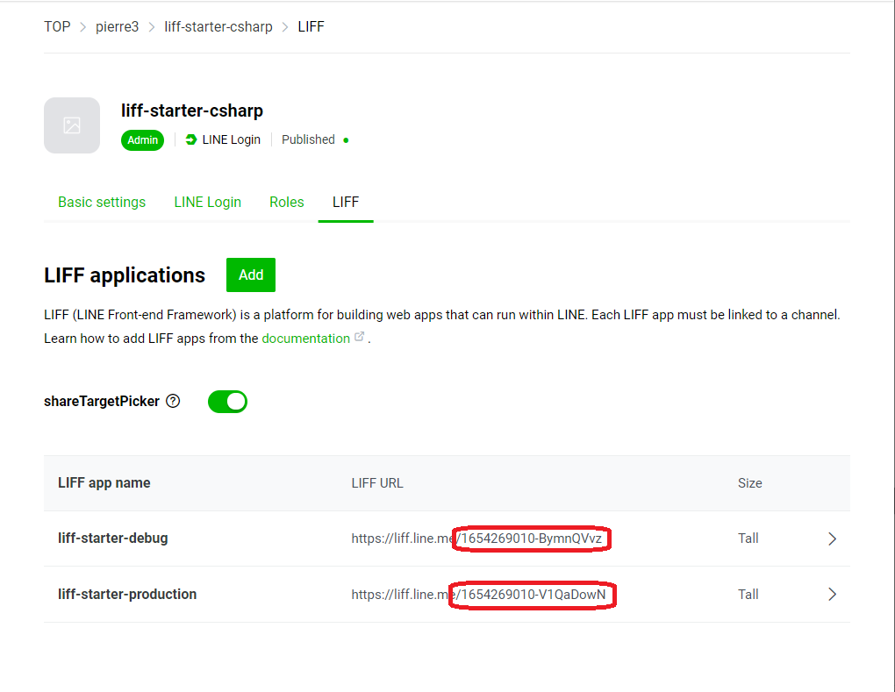
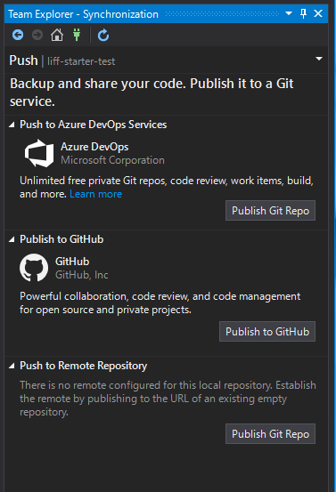
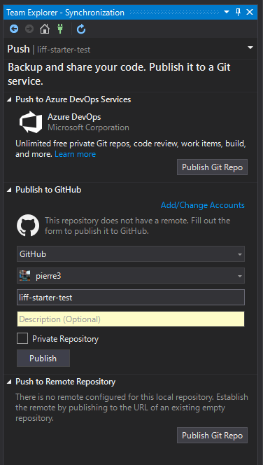
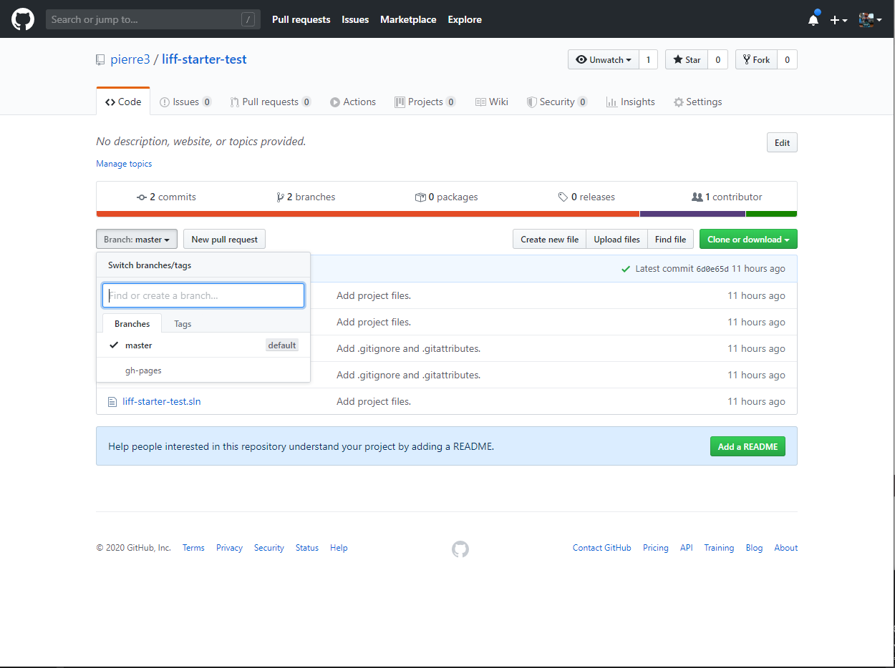
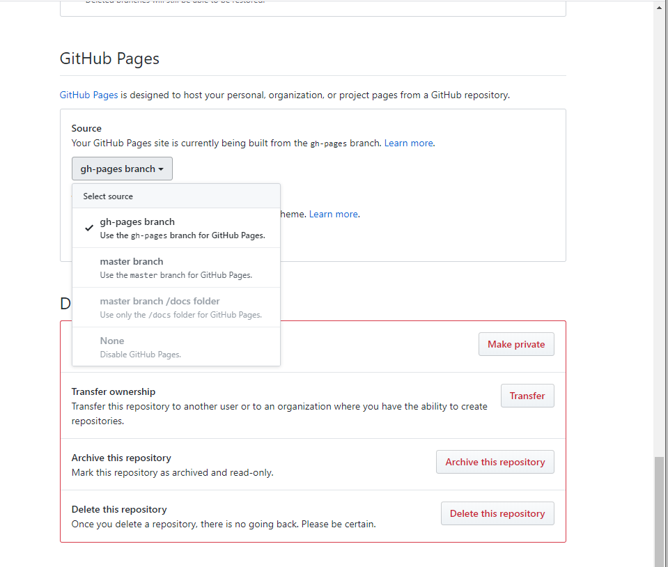
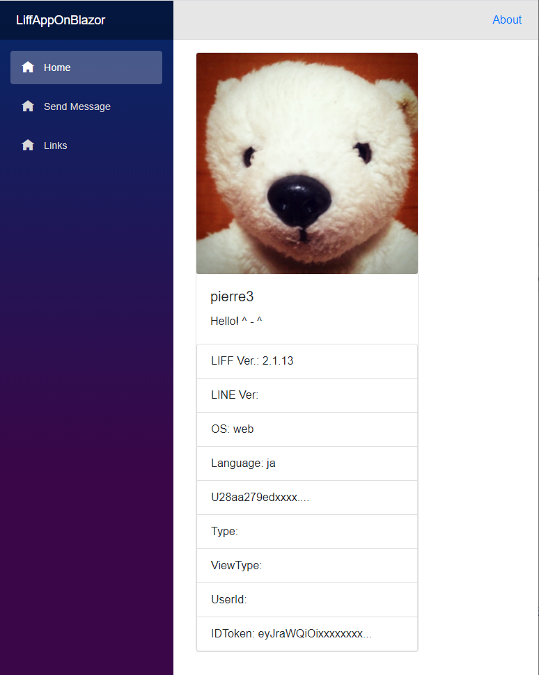

# LIFF Starter C#

A project template for Blazor Webassembly using the LINE Front-end Framework (LIFF).

- A project template for the Blazor WebAssembly SPA, customized to be hosted on a GitHub page.
- Contains sample code that uses a library that wraps the LIFF SDK in C#.
- It includes GitHub Action, which automatically deploys to GitHub Pages when you push it to the master branch.

## Requirements

- [.NET Core 3.1 SDK](https://dotnet.microsoft.com/download/dotnet-core/3.1)
- Visual Studio 2019 v16.6 or later.
  - The __ASP.NET and web development workload__ must be installed.
  - If you want to work with GitHub directly in Visual Studio, install the [GitHub Extension](https://marketplace.visualstudio.com/items?itemName=GitHub.GitHubExtensionforVisualStudio)

## Installation

Download the VSIX installer from the Visual Studio Marketplace or use the Manage extensions dialog box in Visual Studio to install it.

- [LIFF Starter C#](https://marketplace.visualstudio.com/items?itemName=pierre3.LiffStarterCSharp)
- [Find and install extensions - Visual Studio](https://docs.microsoft.com/en-us/visualstudio/ide/finding-and-using-visual-studio-extensions?view=vs-2019)

## Usage

### Create LIFFs

1. Go to the [LINE Developers console](https://developers.line.biz/console/) follow the steps below to create a LINE Login channel.
    - https://developers.line.biz/en/docs/liff/getting-started/#creating-a-provider-and-channel

2. Create LIFFs from the LIFF tab of the created channel page.Create two LIFFs, one for production and one for debugging.  
  
The following items should be set as follows.

    - Endpoint URL: 
        - (for debugging) https://localhost:44302/{your repository name}/
        - (for production) https://{your github account name}.github.io/{your repository name}/
    
    - Scopes: Check all `profile`, `openid` and `chat_message.write`.


### Setup a project

#### Create a project
1. Launch the Visual Studio 2019 and select "Create a New Project".

2. Select "LIFF Starter C#" from the list of projects and click on the "Next" button.



3. "Configure your new project" dialog, enter "project name" and "solution name" and click the "Create" button.
    - In the solution name, enter the name of the repository you want to create on GitHub.



### Set the LIFF ID to the AppSettings

In "appsettings.Deelopment.json", set the LIFF ID for debugging to "DiffId", and set the LIFF ID for production to "DiffId" in "appsettings.json".

- ./wwwroot/appsettings.Development.json
- ./wwwroot/appsettings.json

```json
{
    "LiffId": "1234567890-abcdefgh"
}
```

LIFF ID is a string excluding "https://liff.line.me/" from the LIFF URL.



### Create a GitHub repository and push the project

1. Select the "Add to Source Control" from the "File" menu.
2. Select "Sync" in Team Explorer and click on the "Publish to GitHub" button.



3. "Click on the "Add/Change Accounts" link and log in to GitHub.
4. Make sure that the following information is set in the input form and click "Publish".

- "GitHub"
- (your GitHub account name)
- (Solution name (= GitHub repository name))



5. Go to the GitHub site and make sure the LIFF Starter repository has been created.
6. Click on the "Branch:master" pull-down and make sure that the gh-pages branch is created.  
When you push your code to the master branch, GitHub Actions executes the build and pushes the build artifact to the "gh-pages" branch.



7. On your GitHub repository page, click on the Settings tab and check the GitHub Page section.

8. After selecting "master branch" in the "Source" field pull-down, select "gh-pages branch" again.




9. When you see "Your site is published at {URL}", click on the URL. This should take you to the LIFF Starter site you just created. (It will take a little while for the page to become accessible.)

