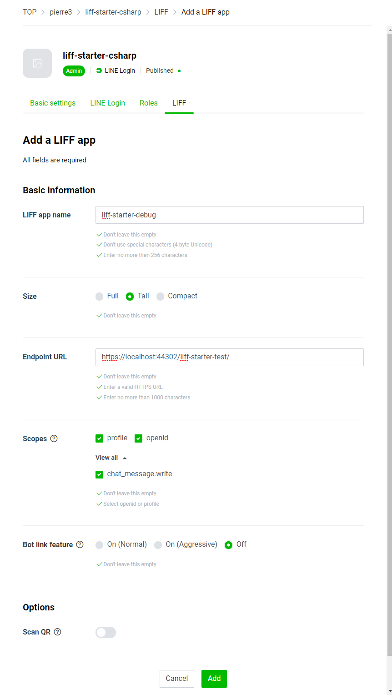

# LIFF Starter C#

A project template for Blazor Webassembly using the LINE Front-end Framework (LIFF).

- A project template for the Blazor WebAssembly SPA, customized to be hosted on a GitHub page.
- Contains sample code that uses a library that wraps the LIFF SDK in C#.
- It includes GitHub Action, which automatically deploys to GitHub Pages when you push it to the master branch.

## Requirements

- Visual Studio 2019 v16.6 or lator.
  - The __ASP.NET and web development workload__ must be installed.
  - If you want to work with GitHub directly in Visual Studio, install the [GitHub Extension](https://marketplace.visualstudio.com/items?itemName=GitHub.GitHubExtensionforVisualStudio)

## Usage

### Create LIFFs

1. Go to the [LINE Developers console](https://developers.line.biz/console/) follow the steps below to create a LINE Login channel.
    - https://developers.line.biz/en/docs/liff/getting-started/#creating-a-provider-and-channel

2. Create LIFFs from the LIFF tab of the created channel page.Create two LIFFs, one for production and one for debugging.  
  
The following items should be set as follows.

    - Endpoint URL: 
        - (for debugging) https://localhost:44302/{your repository name}/
        - (for production) https://{your github account name}.github.io/{your repository name}/
    
    - Scopes: Check all `profile`, `openid` and `chat_message.write`.

### Create a project

